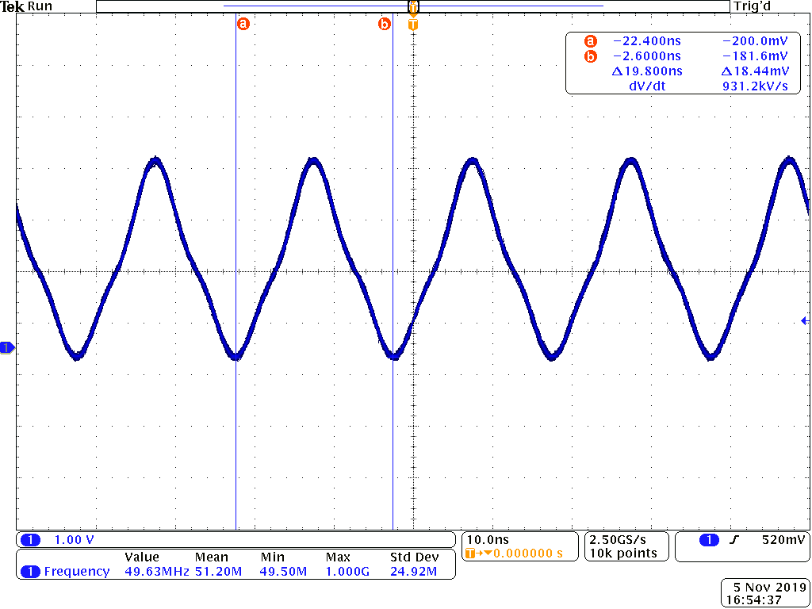
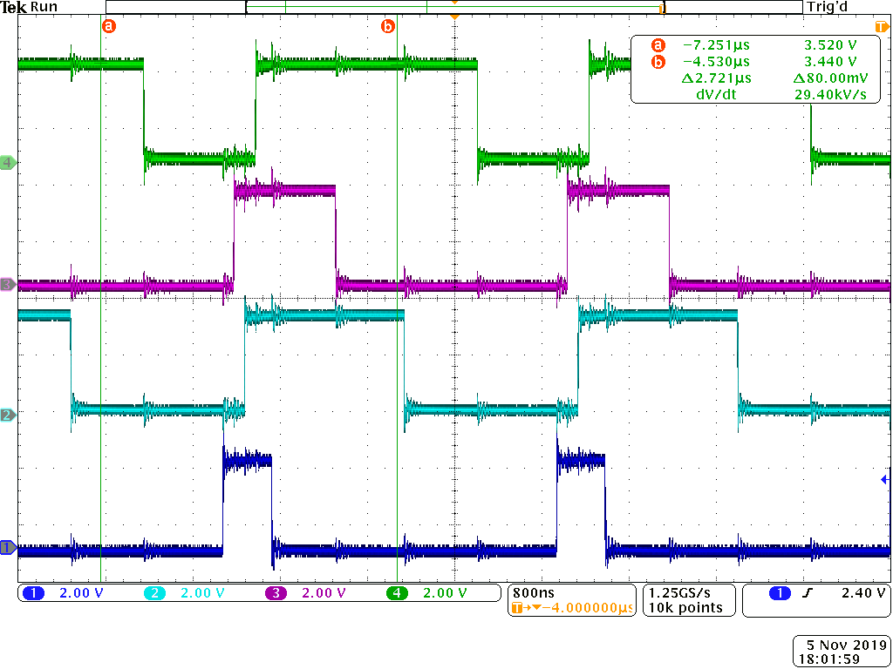
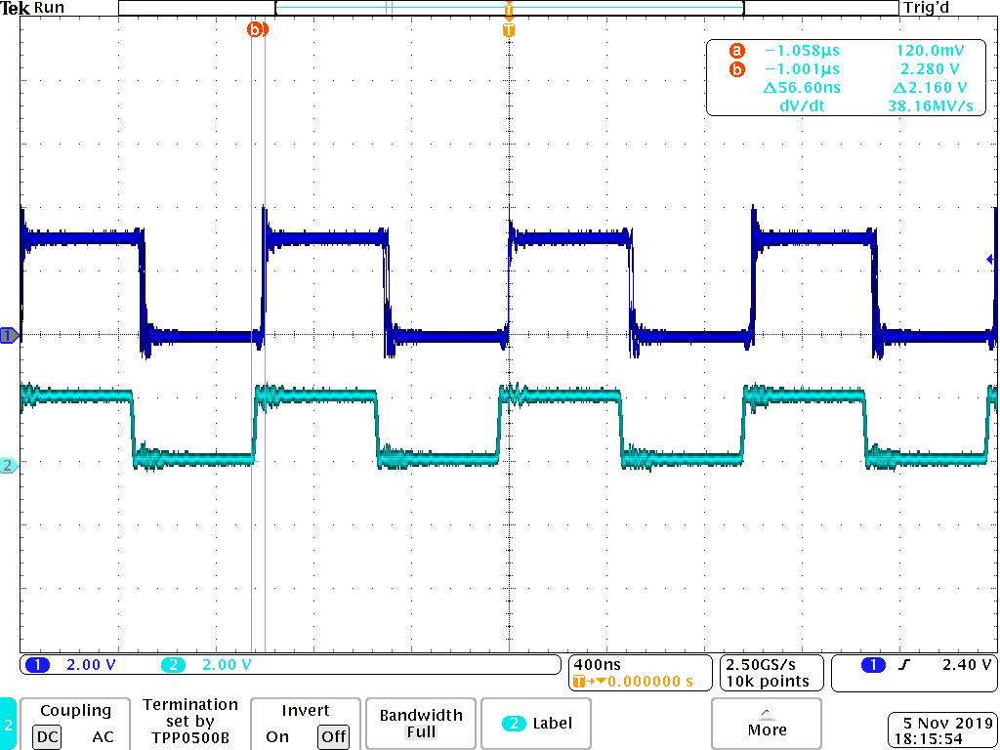

Blinking an LED

	first run setup.sh then to start the running use the command make start
	in order to stop use the command make stop	

PWM Generator
	
	run the following commands
		config-pin P9_31 pruout
		export PRUN=0	
		make

Controlling the PWM Frequency

	P9_28-P9_31 are being driven
	The highest frequency is 
	There is jitter and the STD deviation is

Reading an Input at Regular Intervals

	

## Prof. Yoder's comments

Not started yet... 

Grade:  0/10
